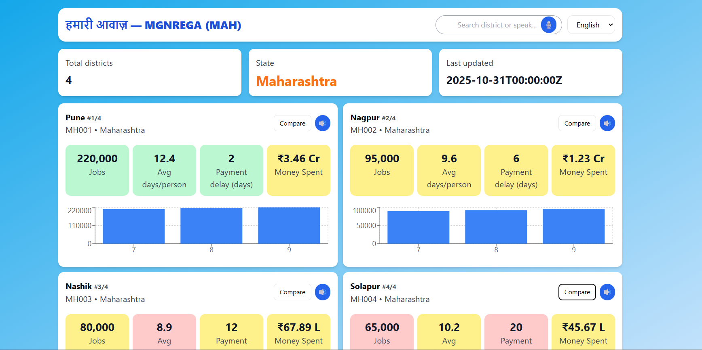

# Bharat Digital MGNREGS Dashboard

### Empowering Citizens with Transparent MGNREGA Data

A user-friendly web platform where any citizen can **select their district** and instantly understand its performance in the **MGNREGA (Mahatma Gandhi National Rural Employment Guarantee Scheme)** program — through **simple visuals, voice, and local language support**.

Built to be **accessible for rural India**, this platform makes complex government data easy to understand even for low-literacy users.

---

## 🧠 Project Overview

This project visualizes MGNREGA performance for each district in a selected state (**Maharashtra**).  
Citizens can explore:

- Total jobs generated  
- Average working days per person  
- Payment delays  
- Total money spent  
- Number of beneficiaries  
- Historical performance trends  

The system displays data from the backend (or local fallback JSON) in a **simple, mobile-friendly interface**, ensuring accessibility even when external APIs are unavailable.

---

## 📊 UI Overview

Shows title banner, voice search, and language selector.  
Citizens can type or speak to search their district easily.

🔍 **Search and Voice Input**  
Voice recognition lets users say district names like “Pune” or “Nagpur”.  
It works in both Hindi and English for accessibility.

🧾 **District Summary Cards**  
Each card represents a district with key metrics —  
Jobs generated, Avg. days per person, Payment delay, etc.  
Color-coded tiles make it visually intuitive (Green = Good, Red = Poor).

📈 **Historical Trends (Bar Chart)**  
Displays last 3 months of performance trends for each district,  
helping citizens understand progress or decline.

## 🌍 Key Features

| Category | Features |
|-----------|-----------|
| 🧾 **Data & Metrics** | Jobs generated, Avg. working days/person, Payment delay, Money spent, Beneficiaries |
| 🎤 **Voice Input** | Search districts via speech (for low-literacy users) |
| 🗣️ **Text-to-Speech** | Reads out district stats aloud |
| 🔄 **Comparative View** | Compare multiple districts' performance |
| 🌐 **Bilingual Support** | English 🇬🇧 & Hindi 🇮🇳 |
| 📊 **Trends Visualization** | Monthly bar chart for each district |
| 💾 **Offline Backup** | Local fallback (`snapshots.json`) if data.gov.in API fails |
| 📱 **Responsive Design** | Works on mobile, tablet, and desktop |

---

## 🧩 System Architecture

    A[Frontend - React + Tailwind + Vite] -->|Fetch Data| B[Backend - Node.js + Express]
    B -->|Reads from| C[snapshots.json / data.js]
    A -->|Voice Input + TTS| D[Browser Speech API]

## 🚀 Steps to Run Locally
**Clone the Repository**
git clone https://github.com/Kunal-6789/Bharat_Digital_MGNREGS_government.git
cd Bharat_Digital_MGNREGS_government
npm install
cd backend
npm run dev
cd frontend 
npm run dev

## ⚙️ Tech Stack

**Frontend**

React + Vite

TailwindCSS (clean responsive UI)

Recharts (bar charts)

Lucide Icons

Web Speech API (Voice + Text-to-Speech)

**Backend**

Node.js + Express

Static JSON storage (data.js, snapshots.json)

API endpoints serving MGNREGA data

## 🧠 Design for Rural India

Large font size and clear color cues (Green/Yellow/Red)

Simple Hindi & English translations for every text

Voice input for low-literacy users

Text-to-Speech to read aloud performance summaries

Mobile-first responsive UI for rural smartphone access

## 🧾 API Structure
Endpoint	Method	Description
/api/health	GET	Check backend status
/api/districts	GET	Fetch all district metrics
/api/districts/:district_code	GET	Fetch single district data

